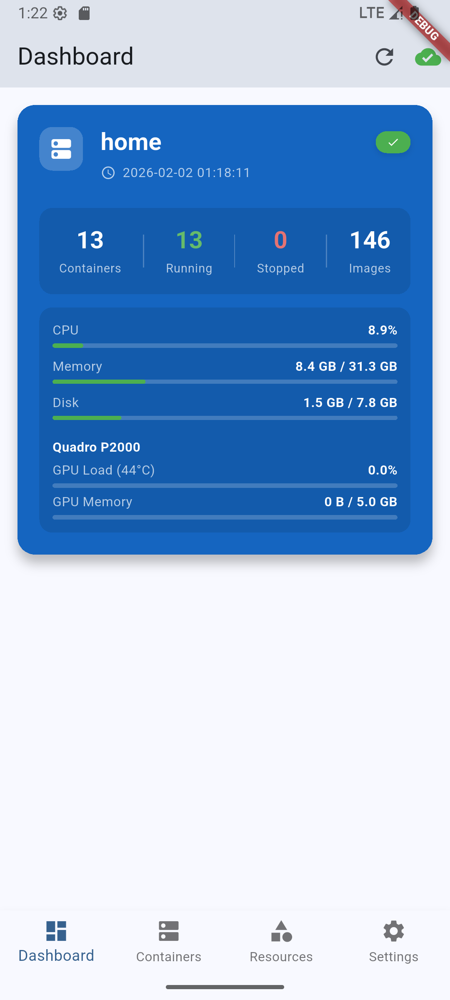
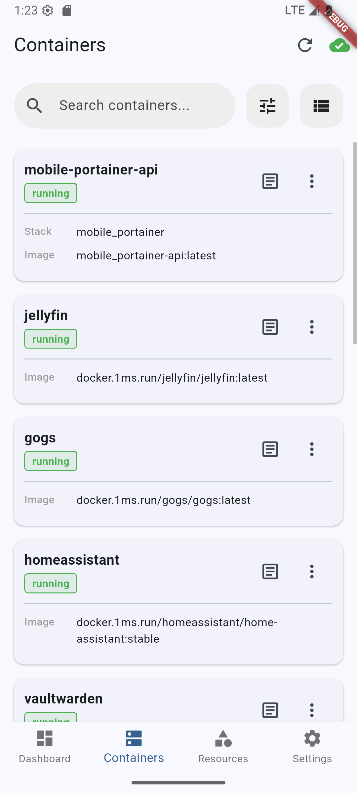
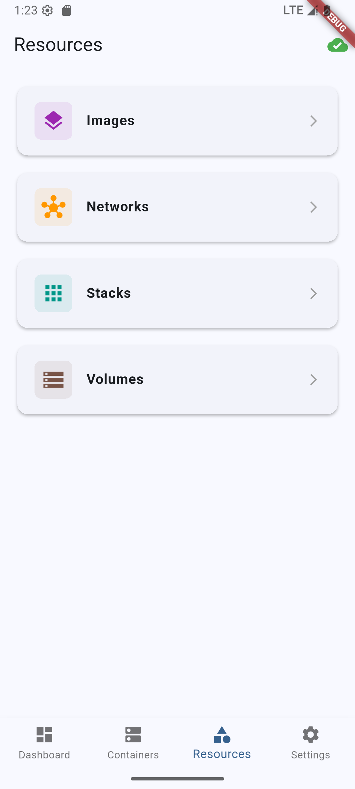
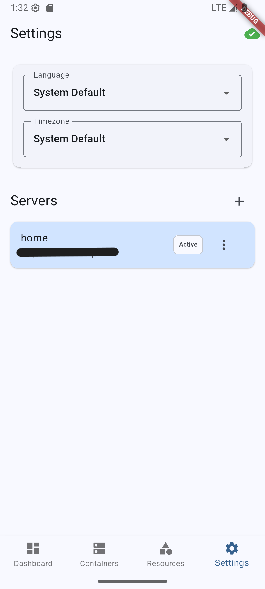

<div style="text-align: center;">
  
</div>

# Mobile Portainer Flutter

[English](README.md) | [中文](README_zh-CN.md)

A cross-platform Docker environment management client built with Flutter. Manage multiple Docker hosts from your mobile device, desktop browser, or macOS — with real-time monitoring and full container lifecycle control.

This is a Flutter **module** (add-to-app mode), designed to be embedded into native host applications. It also supports standalone Web deployment via Docker.

Supported platforms: **Android · iOS · macOS · Web · OpenHarmony**

## ✨ Key Features

### 🖥️ Server Management
- **Multi-Server Support**: Add and manage multiple Docker endpoints with Portainer-compatible APIs.
- **Dashboard Overview**: At-a-glance server status — container counts, image counts, Docker info, and git version.
- **Resource Monitoring**: Real-time visualization of server resources:
  - CPU Usage
  - Memory Usage
  - Disk Usage
  - **GPU Monitoring**: NVIDIA GPU temperature, load, and memory usage.
- **Security**: TLS/SSL support with option to ignore self-signed certificates.

### 📦 Container Management
- **List & Filter**: View containers by status (Running, Stopped, Exited, etc.) or by Stacks.
- **Grid/List Toggle**: Switch between card and compact list layouts.
- **Master-Detail Layout**: On wide screens, view container list and details side by side.
- **Actions**: Create, Start, Stop, Restart, Pause, Unpause, Kill, and Remove containers.
- **Container Details**:
  - **Inspect**: Full JSON configuration inspection.
  - **Stats**: Real-time CPU / Memory / Network / I/O usage.
  - **Logs**: Stream and view container logs.
  - **Environment**: View environment variables.
  - **Network**: Port mappings and network settings.
  - **Storage**: Volume mounts and bind mounts.
  - **Files**: Browse and download files from inside containers.

### 🖼️ Image Management
- List available images with size, ID, and creation date.
- Pull new images from any registry.
- Remove unused images.

### 📚 Stacks Management
- View all Docker Compose stacks.
- Filter containers by stack.
- Inspect stack configurations.

### 💾 Volume & Network Management
- **Volumes**: List, inspect, and remove Docker volumes.
- **Networks**: View network configurations and connected containers.

### 🔑 API Key Management
- Create, list, and revoke API keys (Web admin interface).
- QR code scanning to quickly add server URLs (mobile).

### 🎨 User Experience
- **Dark Mode**: Full light/dark theme support, follows system preference.
- **Internationalization**: English and Chinese (zh-CN) support via ARB.
- **Real-time Updates**: WebSocket integration for live event streaming.
- **Notifications**: Local push notifications for container events.
- **Responsive Design**: Adaptive layouts for mobile, tablet, and desktop.

## 📱 Screenshots

### Web UI

<div align="center">
  
</div>

### Mobile UI

<div align="center">
  
  
  
  
</div>

## 🔌 Backend

This app requires a self-hosted backend service to communicate with Docker hosts.

- **Backend Repository**: [mobile_portainer](https://github.com/CodeFuckee/mobile_portainer)

The backend provides:
- Portainer-compatible REST API for all Docker operations
- WebSocket endpoint for real-time event streaming
- Admin authentication and API key management

## 🚀 Getting Started

### Prerequisites
- [Flutter SDK](https://flutter.dev/) (3.35.8+ recommended; Dart SDK ^3.9.2)
- Android Studio / Xcode (for mobile deployment)
- A running [mobile_portainer](https://github.com/CodeFuckee/mobile_portainer) backend instance

### Installation

1. **Clone the repository**
   ```bash
   git clone https://github.com/CodeFuckee/mobile_portainer_flutter_module.git
   cd mobile_portainer_flutter_module
   ```

2. **Install dependencies**
   ```bash
   flutter pub get
   ```

3. **Run the application**
   ```bash
   # Web
   flutter run -d chrome

   # macOS
   flutter run -d macos

   # Android / iOS (requires connected device)
   flutter run
   ```

### Web Deployment (Docker)

```bash
# Build the web app
flutter build web --release

# Build and run Docker image
docker build -f Dockerfile.web -t mobile-portainer-web .
docker run -d -p 8080:80 mobile-portainer-web
```

Then visit `http://localhost:8080` and log in with your backend admin credentials.

## ⚙️ Configuration

### Adding a Server
1. Navigate to the **Settings** tab.
2. Click **Edit Server List**.
3. Add a new server:
   - **Name**: A friendly name for your server.
   - **URL**: The backend API endpoint (e.g., `http://192.168.1.100:8000`).
   - **API Key**: Your API key (generated from the backend admin panel).
   - **Ignore SSL**: Enable for self-signed certificates.

### Quick Setup via QR Code (Mobile)
1. Generate a QR code containing your server URL.
2. In the app, tap the QR scan button in Settings.
3. Scan the code to auto-fill the server URL.

## 🛠️ Tech Stack

- **Framework**: [Flutter](https://flutter.dev/)
- **Language**: [Dart](https://dart.dev/)
- **Platform Abstraction**: Custom `io` / `web` / `ohos` layers for cross-platform compatibility
- **Key Dependencies**:
  - `http` + custom `HttpHelper`: API communication with platform-specific TLS handling
  - `web_socket_channel` + custom `WsHelper`: Real-time WebSocket events
  - `shared_preferences`: Local storage (with OpenHarmony fallback)
  - `flutter_localizations` + `intl`: Internationalization (English & Chinese)
  - `flutter_local_notifications`: Local push notifications
  - `mobile_scanner`: QR code scanning for server URL input
  - `url_launcher`: Open external links
  - `share_plus`: Share content
  - `package_info_plus` / `device_info_plus`: App and device metadata
  - `permission_handler`: Runtime permission management

## 🏗️ Project Structure

```
lib/
├── main.dart                  # App entry point with auth gate
├── l10n/                      # ARB localization files
├── models/                    # Data models (Container, Image, Volume, etc.)
├── screens/                   # UI screens
│   ├── login_screen.dart      # Web admin login
│   ├── main_tab_screen.dart   # Main tab navigation
│   ├── dashboard_screen.dart  # Server dashboard
│   ├── home_screen.dart       # Container list
│   ├── container_details_screen.dart
│   ├── container_logs_screen.dart
│   ├── container_files_screen.dart
│   ├── images_screen.dart
│   ├── image_details_screen.dart
│   ├── resources_screen.dart  # Volumes, Networks, Stacks
│   ├── stacks_screen.dart
│   ├── volumes_screen.dart
│   ├── networks_screen.dart
│   ├── settings_screen.dart
│   └── api_keys_screen.dart
├── services/
│   ├── docker_service.dart    # All Docker/Portainer API calls
│   ├── auth_service.dart      # Authentication (Web JWT + Native API Key)
│   └── platform/              # Platform abstraction layer
│       ├── http_helper.dart   # HTTP client (io/web)
│       ├── ws_helper.dart     # WebSocket client (io/web)
│       ├── file_helper.dart   # File operations (io/web)
│       └── preferences_service.dart
├── theme/                     # App theming (light + dark)
├── utils/                     # Platform detection, toast, notifications
└── widgets/                   # Reusable UI components
```

## 📄 License

This project is licensed under the MIT License - see the [LICENSE](LICENSE) file for details.
