<div align="center">
  
  <h1>Mobile Portainer Flutter</h1>

  <p>
    <a href="https://github.com/CodeFuckee/mobile_portainer_flutter_module/blob/main/LICENSE">
      
    </a>
    <a href="https://github.com/CodeFuckee/mobile_portainer_flutter_module/actions">
      
    </a>
    <a href="https://hub.docker.com/r/codefuckee/mobile-portainer-web">
      
    </a>
    <a href="https://github.com/CodeFuckee/mobile_portainer_flutter_module/stargazers">
      
    </a>
    <a href="https://github.com/CodeFuckee/mobile_portainer_flutter_module/network/members">
      
    </a>
  </p>

  <p>
    
    
    
    
  </p>
</div>

[English](README.md) | [中文](README_zh-CN.md)

基于 Flutter 构建的跨平台 Docker 环境管理客户端。可从手机、桌面浏览器或 macOS 管理多个 Docker 主机，提供实时监控和完整的容器生命周期控制。

这是一个 Flutter **module**（add-to-app 模式），设计用于嵌入原生宿主应用，同时支持通过 Docker 独立部署 Web 版本。

支持平台：**Android · iOS · macOS · Web · OpenHarmony（鸿蒙）**

## 📈 Star 增长趋势

<a href="https://www.star-history.com/#CodeFuckee/mobile_portainer_flutter_module&Date">
  <picture>
    <source media="(prefers-color-scheme: dark)" srcset="https://api.star-history.com/svg?repos=CodeFuckee/mobile_portainer_flutter_module&type=Date&theme=dark" />
    <source media="(prefers-color-scheme: light)" srcset="https://api.star-history.com/svg?repos=CodeFuckee/mobile_portainer_flutter_module&type=Date" />
    
  </picture>
</a>

## ✨ 主要功能

### 🖥️ 服务器管理
- **多服务器支持**：添加并管理多个 Docker 端点，兼容 Portainer API。
- **仪表盘概览**：服务器状态一目了然 — 容器数量、镜像数量、Docker 信息和 Git 版本。
- **资源监控**：服务器资源的实时可视化：
  - CPU 使用率
  - 内存使用率
  - 磁盘使用率
  - **GPU 监控**：NVIDIA GPU 温度、负载和显存使用。
- **安全性**：支持 TLS/SSL，可忽略自签名证书验证。

### 📦 容器管理
- **列表与筛选**：按状态（运行中、已停止、已退出等）或 Stack 筛选容器。
- **网格/列表切换**：在卡片视图和紧凑列表之间自由切换。
- **主从布局**：宽屏下容器列表与详情并排显示。
- **操作**：创建、启动、停止、重启、暂停、恢复、强制停止和删除容器。
- **容器详情**：
  - **检查 (Inspect)**：完整的 JSON 配置检查。
  - **统计 (Stats)**：实时 CPU / 内存 / 网络 / I/O 使用。
  - **日志 (Logs)**：流式查看容器日志。
  - **环境变量 (Environment)**：查看环境变量。
  - **网络 (Network)**：端口映射和网络设置。
  - **存储 (Storage)**：卷挂载和绑定挂载。
  - **文件 (Files)**：浏览和下载容器内文件。

### 🖼️ 镜像管理
- 列出可用镜像（大小、ID、创建日期）。
- 从任意仓库拉取新镜像。
- 删除未使用的镜像。

### 📚 Stack 管理
- 查看所有 Docker Compose Stack。
- 按 Stack 筛选容器。
- 检查 Stack 配置。

### 💾 卷与网络管理
- **卷 (Volumes)**：列出、检查和删除 Docker 卷。
- **网络 (Networks)**：查看网络配置及已连接的容器。

### 🔑 API Key 管理
- 创建、列出和吊销 API Key（Web 管理界面）。
- 二维码扫描快速添加服务器地址（移动端）。

### 🎨 用户体验
- **深色模式**：完整亮色/暗色主题，跟随系统偏好。
- **国际化**：通过 ARB 支持英文和中文 (zh-CN)。
- **实时更新**：WebSocket 实时事件流推送。
- **通知**：容器事件的本地推送通知。
- **响应式设计**：适配手机、平板和桌面端的自适应布局。

## 📸 截图展示

### Web 端

<div align="center">
  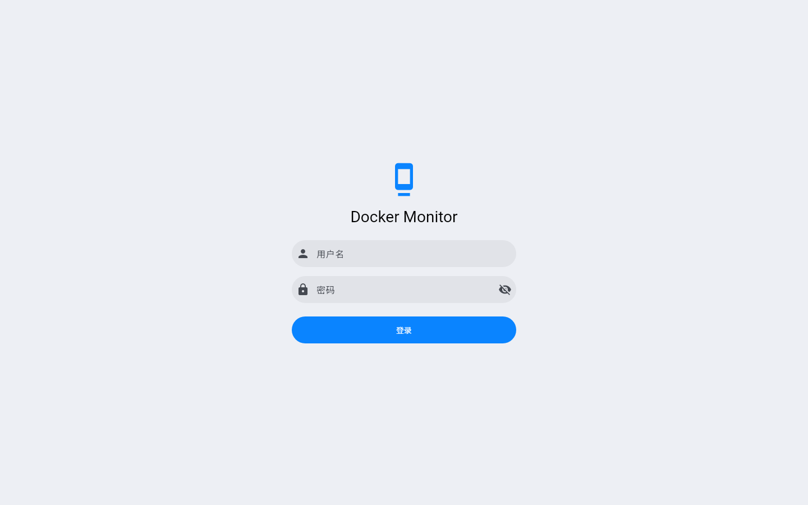
  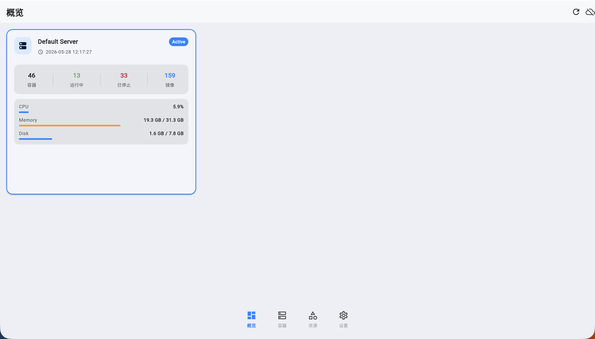
  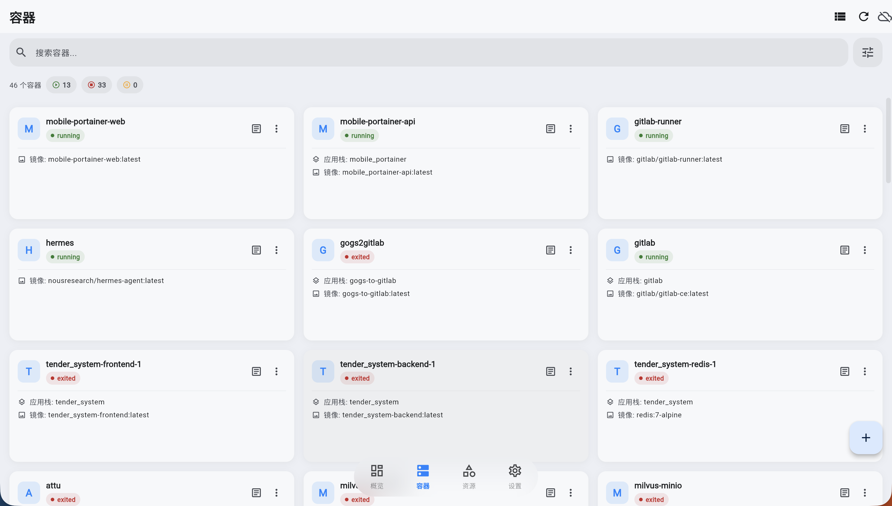
  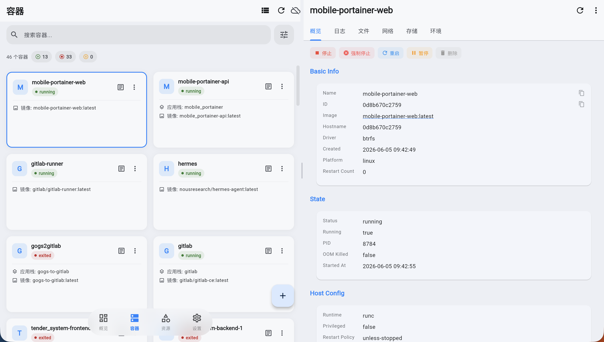
  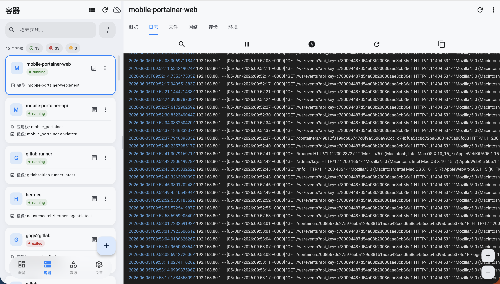
  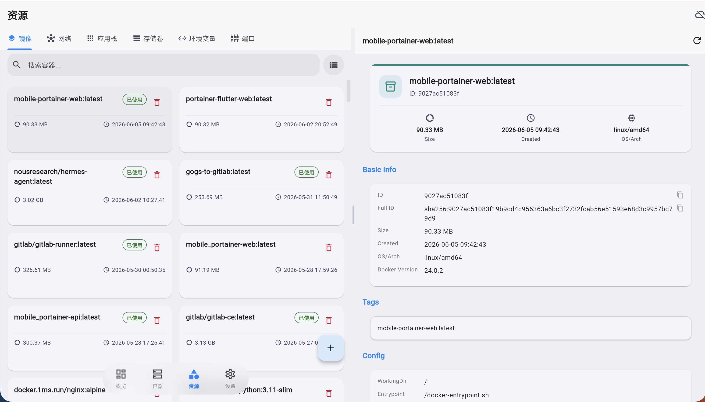
  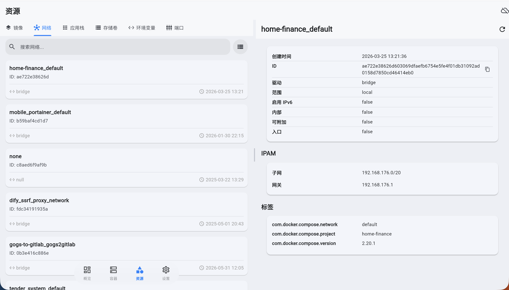
  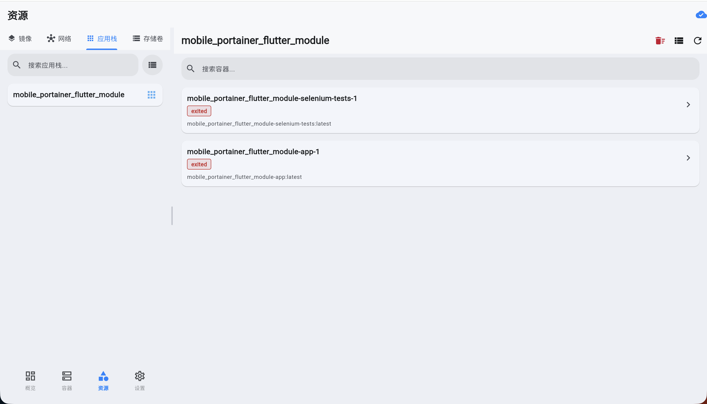
  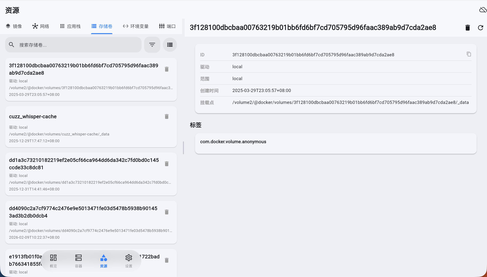
  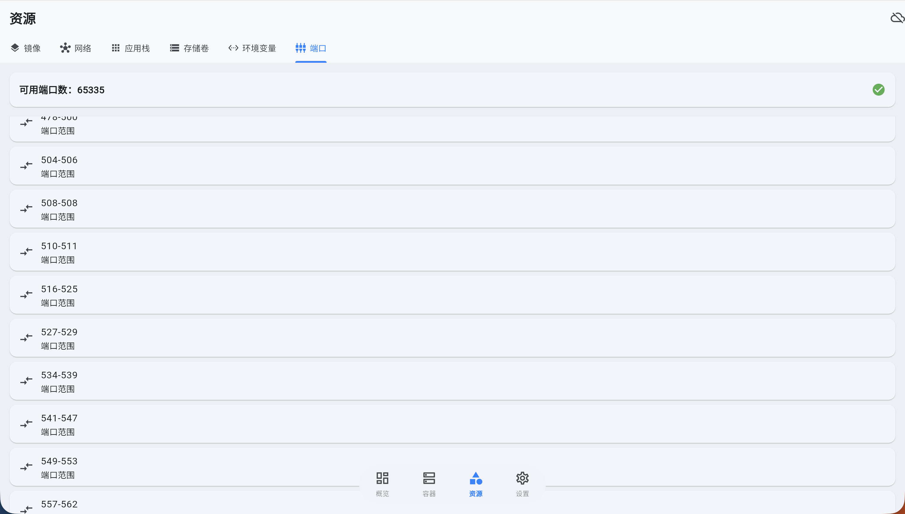
  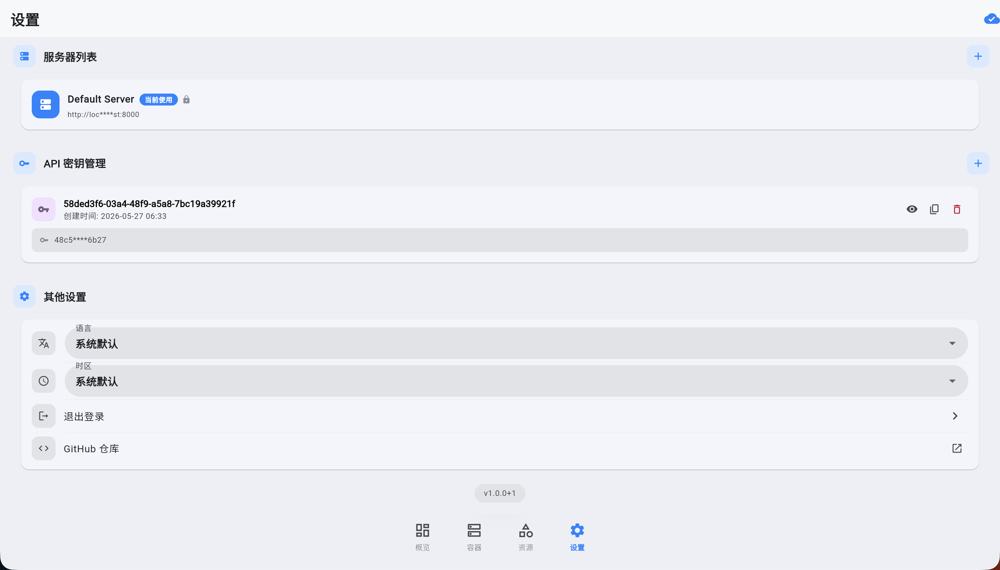
</div>

### 移动端

<div align="center">
  
  
  
  
</div>

## 🔌 后端支持

本应用需要自托管的后端服务来与 Docker 主机通信。

- **后端仓库**：[mobile_portainer](https://github.com/CodeFuckee/mobile_portainer)

后端提供：
- 兼容 Portainer 的 REST API，用于所有 Docker 操作
- WebSocket 端点用于实时事件流
- 管理员认证和 API Key 管理

## 🚀 快速开始

### 前置要求
- [Flutter SDK](https://flutter.dev/)（推荐 3.35.8+；Dart SDK ^3.9.2）
- Android Studio / Xcode（用于移动端部署）
- 一个运行中的 [mobile_portainer](https://github.com/CodeFuckee/mobile_portainer) 后端实例

### 安装步骤

1. **克隆仓库**
   ```bash
   git clone https://github.com/CodeFuckee/mobile_portainer_flutter_module.git
   cd mobile_portainer_flutter_module
   ```

2. **安装依赖**
   ```bash
   flutter pub get
   ```

3. **运行应用**
   ```bash
   # Web
   flutter run -d chrome

   # macOS
   flutter run -d macos

   # Android / iOS（需连接设备）
   flutter run
   ```

### Docker（推荐）

每次推送到 `main` 分支，预构建的 Docker 镜像会自动发布到 **Docker Hub** 和 **GitHub Container Registry**。

#### 方式一：Docker Hub

```bash
docker pull codefuckee/mobile-portainer-web:latest
docker run -d \
  --name mobile-portainer-web \
  -p 8080:80 \
  codefuckee/mobile-portainer-web:latest
```

#### 方式二：GitHub Container Registry

```bash
docker pull ghcr.io/codefuckee/mobile-portainer-web:latest
docker run -d \
  --name mobile-portainer-web \
  -p 8080:80 \
  ghcr.io/codefuckee/mobile-portainer-web:latest
```

#### 方式三：Docker Compose（含后端）

创建 `docker-compose.yml`：

```yaml
version: '3.8'

services:
  api:
    image: codefuckee/mobile-portainer-api:latest
    container_name: mobile-portainer-api
    restart: unless-stopped
    environment:
      - ADMIN_USER=admin
      - ADMIN_PASSWORD=password
      - IGNORED_EVENTS=exec_create,exec_start,exec_die
    volumes:
      - /var/run/docker.sock:/var/run/docker.sock
      - ./data:/app/data
      - /proc:/hostfs/proc:ro
    networks:
      - portainer

  web:
    image: codefuckee/mobile-portainer-web:latest
    container_name: mobile-portainer-web
    restart: unless-stopped
    ports:
      - "8080:80"
    depends_on:
      - api
    networks:
      - portainer

networks:
  portainer:
    driver: bridge
```

然后运行：

```bash
docker compose up -d
```

访问 `http://localhost:8080`，使用后端管理员账号登录。

> **提示**：Web 前端通过 Nginx 将 API 请求代理到后端（参见 [nginx.conf](nginx.conf)）。后端容器必须在同一 Docker 网络中可通过主机名 `mobile_portainer-api` 访问。

### 从源码构建

```bash
# 构建 Web 应用
flutter build web --release

# 本地构建并运行 Docker 镜像
docker build -f Dockerfile.web -t mobile-portainer-web .
docker run -d -p 8080:80 mobile-portainer-web
```

## ⚙️ 配置指南

### 添加服务器
1. 导航至**设置 (Settings)** 标签页。
2. 点击**编辑服务器列表 (Edit Server List)**。
3. 添加新服务器：
   - **名称 (Name)**：服务器的友好名称。
   - **URL**：后端 API 端点（例如 `http://192.168.1.100:8000`）。
   - **API Key**：您的 API Key（从后端管理面板生成）。
   - **忽略 SSL (Ignore SSL)**：自签名证书请开启此选项。

### 通过二维码快速配置（移动端）
1. 生成包含服务器 URL 的二维码。
2. 在应用设置中点击扫码按钮。
3. 扫描二维码自动填入服务器地址。

## 🛠️ 技术栈

- **框架**：[Flutter](https://flutter.dev/)
- **语言**：[Dart](https://dart.dev/)
- **平台抽象**：自定义 `io` / `web` / `ohos` 分层实现跨平台兼容
- **核心依赖**：
  - `http` + 自定义 `HttpHelper`：API 通信，平台特定 TLS 处理
  - `web_socket_channel` + 自定义 `WsHelper`：实时 WebSocket 事件
  - `shared_preferences`：本地存储（含鸿蒙备选方案）
  - `flutter_localizations` + `intl`：国际化（英文和中文）
  - `flutter_local_notifications`：本地推送通知
  - `mobile_scanner`：二维码扫描输入服务器地址
  - `url_launcher`：打开外部链接
  - `share_plus`：分享内容
  - `package_info_plus` / `device_info_plus`：应用和设备元数据
  - `permission_handler`：运行时权限管理

## 🏗️ 项目结构

```
lib/
├── main.dart                  # 应用入口（含认证网关）
├── l10n/                      # ARB 国际化文件
├── models/                    # 数据模型（容器、镜像、卷等）
├── screens/                   # UI 界面
│   ├── login_screen.dart      # Web 管理员登录
│   ├── main_tab_screen.dart   # 主导航标签页
│   ├── dashboard_screen.dart  # 服务器仪表盘
│   ├── home_screen.dart       # 容器列表
│   ├── container_details_screen.dart
│   ├── container_logs_screen.dart
│   ├── container_files_screen.dart
│   ├── images_screen.dart
│   ├── image_details_screen.dart
│   ├── resources_screen.dart  # 卷、网络、Stack
│   ├── stacks_screen.dart
│   ├── volumes_screen.dart
│   ├── networks_screen.dart
│   ├── settings_screen.dart
│   └── api_keys_screen.dart
├── services/
│   ├── docker_service.dart    # 所有 Docker/Portainer API 调用
│   ├── auth_service.dart      # 认证（Web JWT + 原生 API Key）
│   └── platform/              # 平台抽象层
│       ├── http_helper.dart   # HTTP 客户端 (io/web)
│       ├── ws_helper.dart     # WebSocket 客户端 (io/web)
│       ├── file_helper.dart   # 文件操作 (io/web)
│       └── preferences_service.dart
├── theme/                     # 应用主题（亮色 + 暗色）
├── utils/                     # 平台检测、Toast、通知
└── widgets/                   # 可复用 UI 组件
```

## 📄 许可证

本项目基于 MIT 许可证开源 - 详情请参阅 [LICENSE](LICENSE) 文件。
